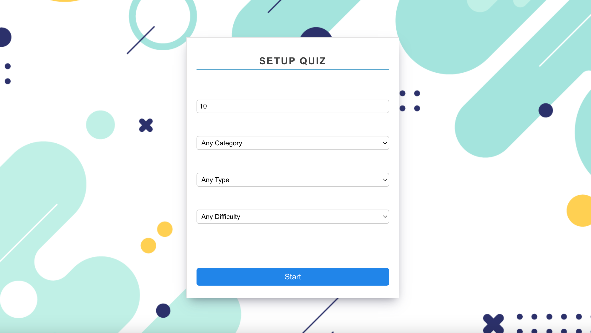
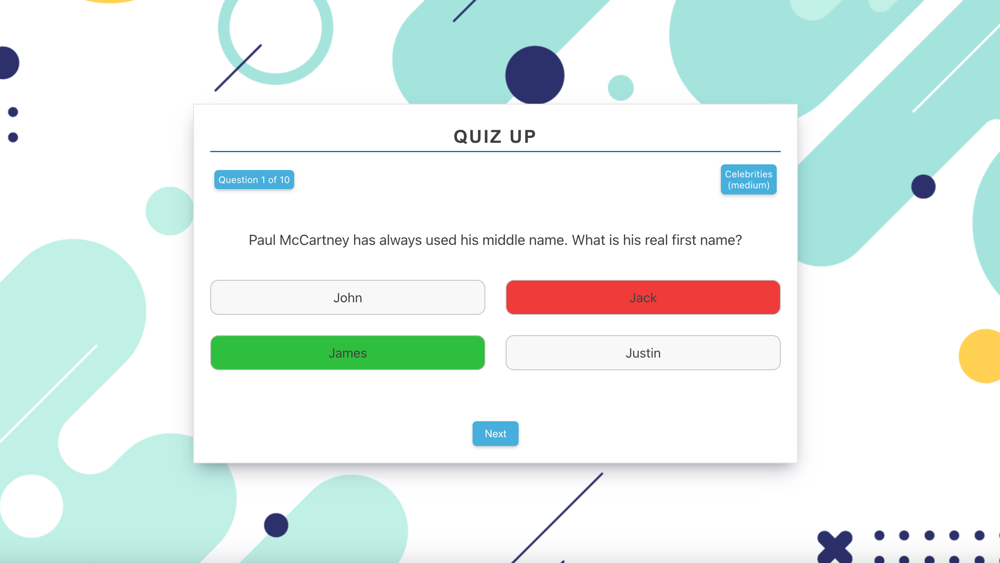
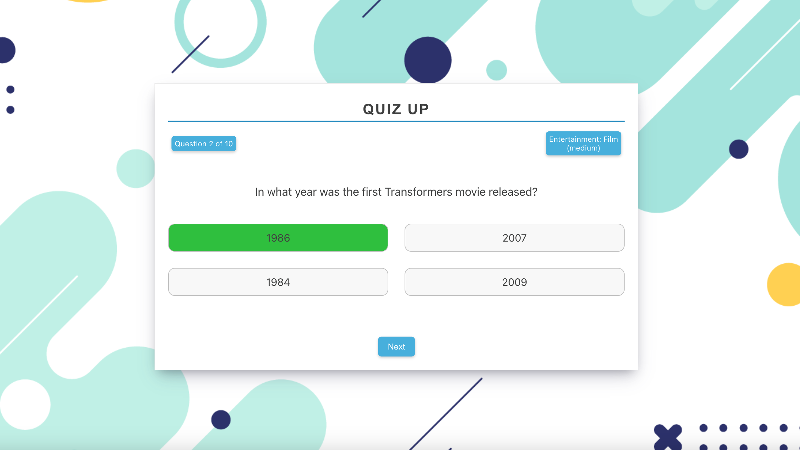
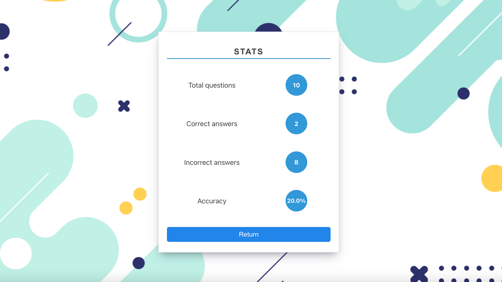

# Quiz-app (React)

## 📄  Description

The quiz application offers users the versatility to customize their quiz experience. Users can specify the number of questions, category, difficulty level, and question type to create a custom quiz. The app sources quiz content from the TriviaAPI, resulting in a unique quiz for each user. Upon the completion, fundamental statistics are displayed. 

## 💻  Technologies

- React
- Redux
- Axios
- Routing
- CSS
- LocalStorage

## 🖼️  Screenshots

